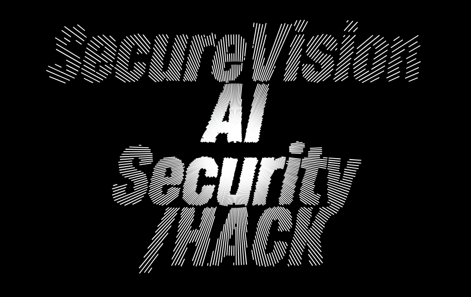
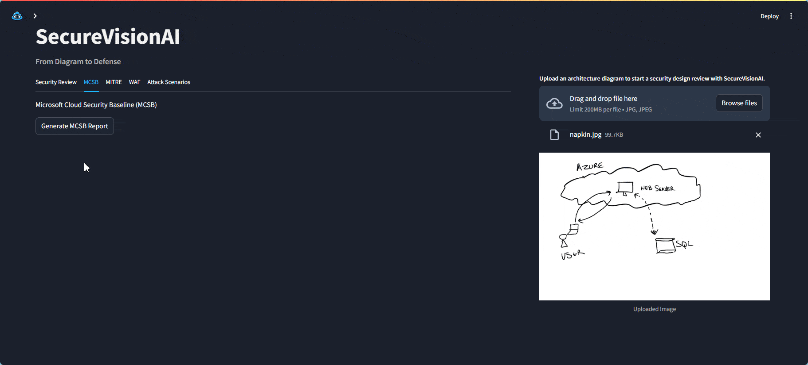

<p align="center">
  <a href="" rel="noopener">
 </a>
</p>
<h3 align="center">SecureVision AI<br>From Diagram to Defense: Security at a Glance. Blueprint Today, Bulletproof Tomorrow.</h3>

<div align="center">

  [](https://hackbox.microsoft.com/hackathons/hackathon2024/project/63238) 
  []() 
  []()
  []()
  [](LICENSE.md)

</div>

---

<p align="center"> Empower developers and their teams to reduce the time to go from idea to value.
    <br> 
</p>

## 📝 Table of Contents
- [📝 Table of Contents](#-table-of-contents)
- [🧐 Problem Statement <a name = "problem_statement"></a>](#-problem-statement-)
- [💡 Idea / Solution <a name = "idea"></a>](#-idea--solution-)
- [⛓️ Dependencies / Limitations <a name = "limitations"></a>](#️-dependencies--limitations-)
- [🚀 Future Scope <a name = "future_scope"></a>](#-future-scope-)
- [🏁 Getting Started <a name = "getting_started"></a>](#-getting-started-)
  - [Prerequisites](#prerequisites)
  - [Installing](#installing)
- [🎈 Usage <a name="usage"></a>](#-usage-)
- [⛏️ Built With <a name = "tech_stack"></a>](#️-built-with-)
- [✍️ Team <a name = "authors"></a>](#️-team-)
- [🎉 Acknowledgments <a name = "acknowledgments"></a>](#-acknowledgments-)

# **SecureVision AI**: From Diagram to Defense


## Project Overview

**SecureVision AI** is a ground-breaking tool that transforms the way teams approach security in their cloud and system architectures. By leveraging the power of visual analysis and AI-driven insights, we're bridging the gap between design and defense.

## What it Does

Our platform allows users to upload their:

* Design diagrams
* Reference architectures
* Threat model diagrams

SecureVision AI then springs into action, providing:

1. **Instant Analysis**: Using advanced AI algorithms, we scan your diagrams against top security frameworks like Microsoft Cloud Security Benchmark, STRIDE Model, MITRE ATT&CK, and DEFEND.

    <p align="center">
     </a>
    </p>

2. **Interactive Exploration**: Engage in a dynamic chat with our AI to dive deep into specific areas of your design, uncovering potential vulnerabilities and exploring solutions.

    <p align="center">
     </a>
    </p>

3. **Actionable Insights**: Receive concrete, prioritized steps to enhance your security posture, tailored to your unique architecture.

    <p align="center">
     </a>
    </p>

4. **Comprehensive Reporting**: Download a detailed report of your session, complete with all identified issues and recommended actions.

    <p align="center">
     </a>
    </p>

## Current Status

Here are the sample output of the latest key features that SecureVision AI can produce:

## Environment Setup

Follow the guide below to set up SecureVision AI for your own tryout.


### Pre-requisites

* Azure Subscription
* Python 3.12 or higher
* Docker (optional)

### Set Up Azure OpenAI

1. Get an Azure Subscription
2. Create an Azure OpenAI deployment  
   a. Go to AzureOpenAI on the Azure portal  
   b. Create Azure OpenAI Deployment to your specifications  
   c. Go to OpenAI Studio (oai.azure.com)  
   d. Create new deployment, sample values:  

|                         |            |
| ----------------------- | ---------- |
| Name:                   | GPT-4OMNI  |
| Model:                  | gpt-4o     |
| Version:                | 2024-05-13 |
| Deployment Type:        | Standard   |
| Tokens per minute rate: | 150k       |
| Content Filter:         | Default    |
| Dynamic Quota:          | Enabled    |
|                         |            |  

3. Open your model in Playground  
4. Click "View Code"  
5. Note your endpoint and key  

### Set Up Python App
1. Open Terminal, install Python and Docker Desktop (optional):

    ```bash
    Winget install Python
    ```

    ```bash
    Winget install "Docker Desktop""
    ```

2. Clone the repository from the main branch to a local folder (do not use the same git directory as you need to add secrets to your .env file)

    ```bash
    git clone url
    ```

3. Rename .env.sample to .env and update the following:  
AZURE_API_KEY = "-----"  
AZURE_ENDPOINT = "https://<deployment-uri>.openai.azure.com"  
AZURE_DEPLOYMENT_NAME = "Name from Above Table"  
AZURE_API_VERSION = "Version from above table"  
DEBUG_MODE = False  

> [!CAUTION]
> If you are calling the API with Key directly make sure to update the `.env` file with the correct values. If you would like to store the secret in a Keyvault, make sure to provide the key vault endpoint and set the `USE_KEYVAULT` value as `true`

4. Navigate to the APP directory:

    ```bash
    cd reviewer
    ```

> [!IMPORTANT]
> Note: Make a copy of `.env.sample` and rename it to `.env` and update the values accordingly.

5. Create a virtual environment:

    ```bash
    python -m venv .venv
    ```

6. Activate the virtual environment:

    - For Windows:

      ```bash
      .venv\Scripts\activate
      ```

    - For macOS/Linux:

      ```bash
      source .venv/bin/activate
      ```

7. Install the required dependencies:

    ```bash
    pip install -r requirements.txt
    ```

6. Make sure a `.env` file is in the root directory of the reviewer folder and add your specific environment variables using the `.env.sample` file as a template.


### Running the Streamlit App

1. Start the Streamlit app:

    ```bash
    python -m streamlit run main.py
    ```

2. Open your web browser and navigate to `http://localhost:8501` to view the app.


## Deployment via Docker

Update the `.env` file with the required environment variables before proceeding further.

1. Build the Docker image:

    ```bash
    docker build -t reviewer .
    ```
2. Run the Docker container:

    ```bash
    docker run -p 8501:8501 reviewer
    ```
3. Open your web browser and navigate to `http://localhost:8501` to view the app.


4. Alternatively, you can use the following

    ```bash
    docker build -t reviewer . && docker run -p 8501:8501 reviewer
    ```

# Contributor(s)

**IDC V-Team:**
<br> Ashik <ashikkuppili@microsoft.com>, <br> Jitesh <jitha@microsoft.com>, <br> Krishna <kguttula@microsoft.com>, <br> Manav <sharmama@microsoft.com>, <br> Shalabh <shalabh.pradhan@microsoft.com>

**Redmond V-Team:**  
<br> Donald Scott <donald.scott@microsoft.com>, <br> Jason Hennessy <jason.hennessy@microsoft.com>, <br> Jeff Surek <jesurek@microsoft.com>, <br> Ming Oei <mingo@microsoft.com>, <br> Sreedhar Ande <sreedhar.ande@microsoft.com>, <br> Sushant Sood <ssood26@microsoft.com>, <br> Will Chen <chenwi@microsoft.com>
